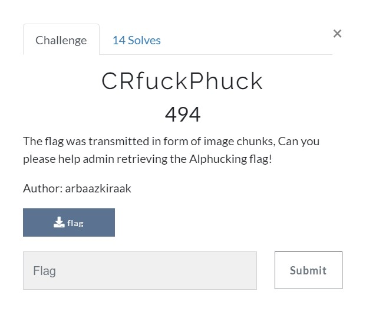
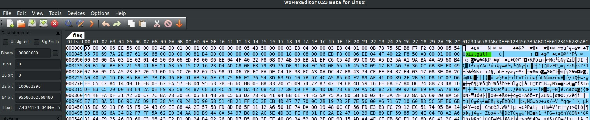
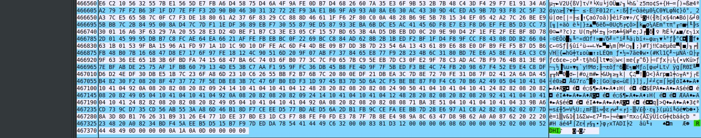

# CRfuckPhuck
Miscellaneous

We are provided with a file [flag](./CRfuckPhuck/flag) which have no extensions and is corrupted in some sort. After using most of the tools I was not able to find anything. Then we looked at the Hexdump of file and found a file flag.zip and a corrupted png header at the last reversed. 

  

The whole hex was reveresed using 

	$ <flag xxd -p -c1 | tac | xxd -p -r > reverse 

found the reveresed file [reverse](./CRfuckPhuck/reverse). 

After using foremost we found a password locked zip file [zip](./CRfuckPhuck/output/temp.zip) which contained a flag.zip file.

Correcting the header of reverse file gave me a png image 

 

which had the password "B@TN00t@Fl@g" for the zip file.

