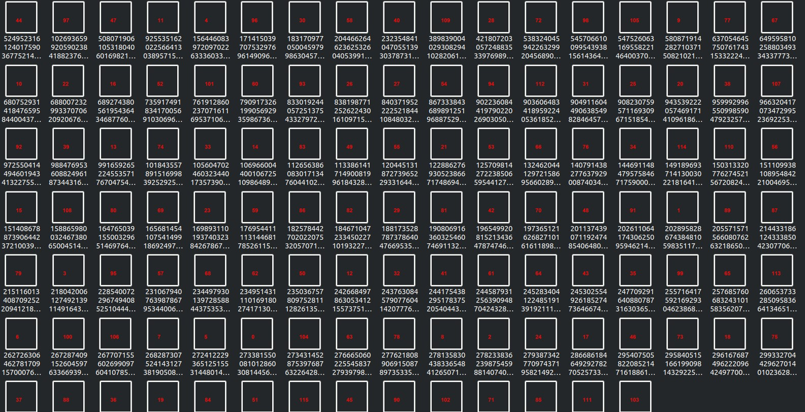
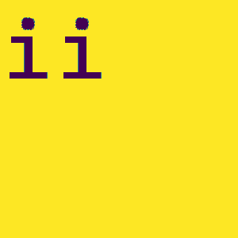

# CRfuckPhuck
Miscellaneous

We are provided with a file [flag](./CRfuckPhuck/flag) which have no extensions and is corrupted in some sort. After using most of the tools I was not able to find anything. Then we looked at the Hexdump of file and found a file flag.zip and a corrupted png header at the last reversed. 

  

The whole hex was reveresed using 

	$ <flag xxd -p -c1 | tac | xxd -p -r > reverse 

found the reveresed file [reverse](./CRfuckPhuck/reverse). 

After using foremost we found a password locked zip file [zip](./CRfuckPhuck/output/temp.zip) which contained a flag.zip file.
Correcting the header of reverse file gave me a png image 

 

which had the password "B@TN00t@Fl@g" for the zip file.

After extracting and unzipping flag.zip we get a folder named flagchunks having 116 png images numbered from 0. 

After fiddling for some time I found that after using stegosolve tool on these images there is some text in their LSB xor. 

After some researching I found it was a part of Alphuck Esolang programming language (!Hint in Description regarding Alphucking Language). Therefore we had to arrange the image in the order of no. in them and then using the combined text after Xor LSB of images we will get an Alphuck Code.

Code [lsbxor](./CRfuckPhuck/lsbxor.py) to automate xor of each files

To correctly order the images according to the number in them. 
